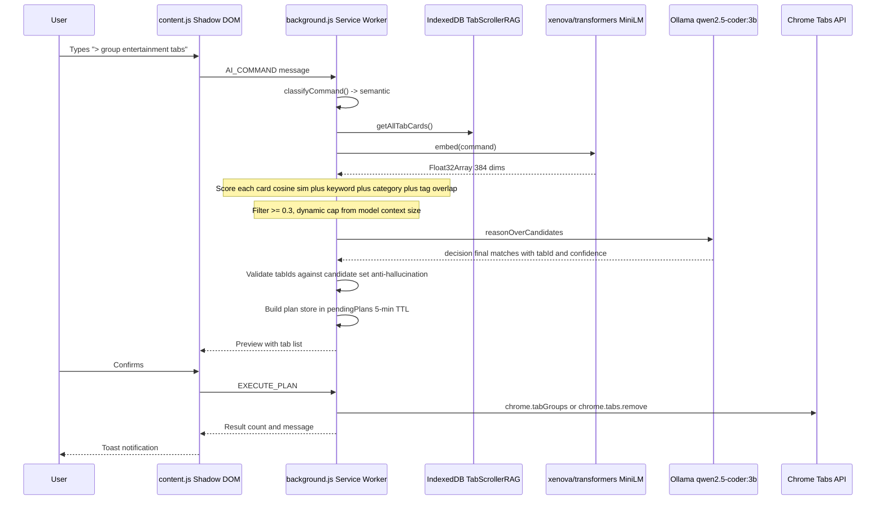
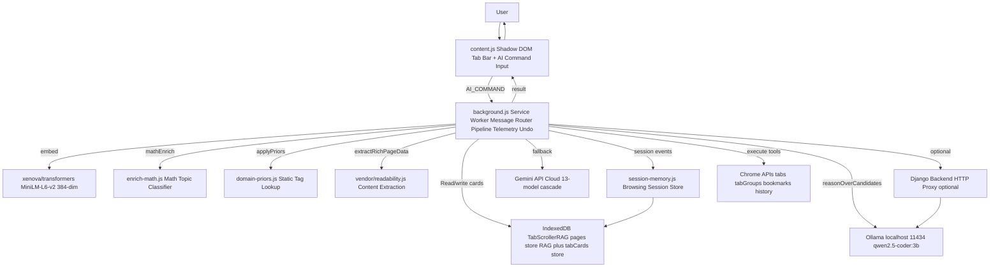

# Project Overview — Tab Scroller

**Type:** Chrome Extension (Manifest V3) + optional Django backend
**Stack:** Vanilla JavaScript, Python/Django, Ollama (local LLM), MiniLM (local embeddings), IndexedDB
**Stage:** Advanced prototype / MVP — feature-complete for core use cases, not yet production-hardened

---

## 1. Executive Summary

Tab Scroller is a Chrome extension that adds a hover-activated tab management bar and an AI-powered natural language command interface to the browser. The core value proposition is letting a user type a plain-English command like `> group all entertainment tabs` or `> bookmark my research tabs` and have the extension intelligently select and act on the matching tabs.

The architecture has three phases of interest. First, a **content script** (`content.js`) injects a Shadow DOM overlay into every page, rendering the tab bar and capturing commands typed with a `>` prefix. Second, those commands are sent to a **service worker** (`background.js`) which classifies the command, runs a local hybrid retrieval pipeline to find candidate tabs, and — for semantic queries — calls a locally-running LLM via Ollama to decide which tool to invoke. Third, the service worker executes the tool against Chrome's tabs API and returns a result toast to the content script.

The most important engineering decisions are: keeping the LLM out of tab ID selection (it only picks the action and parameters), running everything locally using `@xenova/transformers` and Ollama (no mandatory cloud API), and using a multi-signal scoring system (cosine embedding similarity, keyword overlap, domain priors, and enrichment tags) to retrieve candidates before sending them to the model.

Current strengths include the privacy-first architecture, depth of the enrichment pipeline (Readability, JSON-LD, MiniLM, math-based tag scoring), and the telemetry/undo infrastructure. The most significant limitations are the absence of tests for the command pipeline, occasional LLM mis-classification with small 3B models, and no production deployment infrastructure.

---

## 2. Problem Statement

Power users with dozens or hundreds of open tabs face a genuine productivity problem: the browser tab bar becomes too crowded to navigate, Chrome's built-in grouping is manual, and bookmarking is tedious.

This project removes the friction by letting the user express intent in natural language. Without the extension, grouping all coding-related tabs means scrolling visually, identifying each tab, dragging it into a group, and naming the group. With the extension, this collapses to `> group all coding tabs`.

The project assumes users are power users with many tabs open, and are either privacy-conscious (preferring local LLMs) or willing to use a Gemini API key for cloud fallback.

---

## 3. Target Users and Use Cases

**Primary users (verified)**
- Knowledge workers managing 20-400+ simultaneous open tabs
- Developers wanting to organise tabs by project or domain
- Researchers accumulating tabs across multiple topics

**Verified use cases (from TOOL_SCHEMA in background.js)**
- Group tabs by topic, domain, or enrichment category
- Close tabs matching a pattern
- Pin or mute specific tabs
- Bookmark tabs into named folders
- Search and switch to a specific tab
- Recall what a previously visited page contained (vector search over browsing history)
- Analyse current tabs: duplicates, inactive, by-domain summary
- Sort tabs by domain, title, or last-active time
- Query past browsing sessions

**Less obvious use cases**
- `recall_tabs` queries IndexedDB page content via MiniLM embeddings — users can ask "find that article about protein folding I had open last week" against genuinely stored vectors
- Session Memory Engine reconstructs what topics a user was researching in past sessions
- The Bookmark Organiser (bookmarks.html) is a separate page for bulk bookmark management

---

## 4. Core User Journey

**Failure modes:**
- Embedding model not loaded: falls back to keyword-only scoring
- Ollama server offline: returns provider error, surfaced as toast
- Model returns need_details: second round-trip with full page text (adds 5-10s)
- Chrome API fails on a protected tab: per-tab error logged, others succeed via Promise.allSettled
- Service worker evicted: pendingPlans lost (5-minute expiry surfaces this gracefully)

---

## 5. Feature Breakdown

### AI Natural Language Commands - Fully Implemented
Core feature. Tools: group_tabs, close_tabs, bookmark_tabs, pin_tabs, mute_tabs, reload_tabs, sort_tabs, search_and_switch, analyze_tabs, recall_tabs, query_sessions.

### Hover Tab Bar - Fully Implemented
Shadow DOM overlay at top of every page. Scrolling, drag-to-reorder, fuzzy search, favicon loading with mixed-content protection, audio indicators, context menus. Uses `html { padding-top: 36px }` instead of body transform (body transform broke YouTube video compositing).

### Math-Based Enrichment Pipeline - Fully Implemented
tab-cards.js uses Mozilla Readability for article extraction, JSON-LD structured data parsing, and enrich-math.js (centroid-based topic classifier). Zero LLM calls at enrichment time.

### Session Memory Engine - Fully Implemented
session-memory.js tracks browsing sessions in chrome.storage.local. Up to 50 sessions retained. Each records tab events with timestamps and page snippets. Queryable via query_sessions.

### RAG-Based Tab Recall - Fully Implemented
recall-tabs.js + db.js + embed.js implement vector search over visited pages. MiniLM embeddings in IndexedDB pages store. Category and time-range filters supported.

### Multi-Provider AI - Fully Implemented
Gemini (13-model fallback cascade with rate-limit tracking), Ollama (local), Django backend (HTTP proxy). Dynamic candidate cap: floor((contextSize / 50) * 0.9).

### Undo / Transaction Log - Fully Implemented
In-memory transactionLog (last 50 actions) captures before-state for close, group, pin, mute, bookmark operations.

### Preview/Confirm Flow - Partially Implemented
Pipeline builds a plan with 5-minute expiry. Users can uncheck tabs before confirming. EXECUTE_PLAN validates IDs against original plan. UI polish is incomplete.

### Telemetry - Implemented Local Only
Buffered logging to chrome.storage.local. 7-day retention, max 500 entries. No data leaves the device.

---
## 6. Technology Stack

| Layer | Technology | Where Used | Why It Fits | Trade-Offs |
|-------|------------|-----------|-------------|------------|
| Extension Runtime | Chrome MV3 Vanilla JS | All extension files | Required by Chrome; no build step | Service worker lifecycle; no persistent background page |
| UI Isolation | Shadow DOM closed mode | content.js | Prevents page CSS interference | Playwright cannot reach closed Shadow DOM |
| Embedding Model | xenova/transformers MiniLM-L6-v2 | embed.js vendor/transformers.min.js | Runs in-browser; no API key; 384-dim | First-load ONNX compile delay; 22MB vendor file |
| Vector Store | IndexedDB TabScrollerRAG | db.js | Built into Chrome; offline; no install | Brute-force cosine search; slow at 10K+ docs |
| Local LLM | Ollama qwen2.5-coder:3b | background.js callOllama | Local; private; no API cost | 5-10s inference; requires Ollama installed |
| Cloud LLM | Gemini API | callGeminiWithFallback | 1M token context; fast; free tier | Privacy: titles sent to Google; rate limits |
| LLM Gateway | Django 4+ Python | backend/api/views.py | Simple HTTP proxy; adds auth layer | Extra latency; must run locally; sync requests |
| Enrichment | Custom centroid classifier | enrich-math.js | Zero-cost topic tagging | Fixed 20-topic vocabulary |
| Domain Priors | Static lookup table | domain-priors.js | Instant deterministic | ~50 domains; manual maintenance |
| Content Extraction | Mozilla Readability vendored | tab-cards.js | Battle-tested article extraction | Fails on SPAs; injected into page context |
| Testing | Jest 30 fake-indexeddb Playwright | *.test.js tests/ | Jest covers unit logic | E2E blocked by closed Shadow DOM |

---

## 7. High-Level Architecture

---

## 8. Module and Folder Map

| Path | Responsibility | Important Notes |
|------|--------------|----------------|
| manifest.json | Extension entry point permissions | No alarms permission |
| background.js | Service worker: routing AI pipeline tool execution telemetry undo | 4652 lines; largest file; all AI logic |
| command-agent.js | classifyCommand retrieveCandidates reasonOverCandidates | Loaded via importScripts in service worker |
| content.js | Shadow DOM tab bar AI command input preview/confirm UI | 2753 lines |
| tab-cards.js | buildTabCard: extraction enrichment embedding caching | Uses EnrichMath Embed DomainPriors |
| enrich-math.js | mathEnrich centroid-based multi-label topic tagging | ~20 topic prototypes; pure math; no LLM |
| domain-priors.js | applyPriors static domain to tag lookup for ~50 domains | Also handles subreddit paths |
| db.js | IndexedDB abstraction with built-in cosine search | DB version 3; two object stores |
| embed.js | Embed.embed via MiniLM | First call loads ONNX model |
| indexer.js | Indexer.indexTab stores page plus embedding to pages RAG store | Separate from tab-cards enrichment |
| recall-tabs.js | RecallTabs.search semantic search over past pages | Used by recall_tabs tool |
| session-memory.js | Tracks and recalls browsing sessions | Max 50 sessions in chrome.storage.local |
| options.js/html | Settings: theme AI provider Ollama config session config | Writes to chrome.storage.sync |
| backend/api/views.py | Django: /api/generate /api/chat /api/summarize /api/embeddings | Optional; @csrf_exempt on all views |
| vendor/ | Readability.js transformers.min.js | Vendored for MV3 CSP compliance |
| *.test.js root | Unit tests: db embed indexer recall-tabs tabcard | Jest plus fake-indexeddb |

---

## 9. Data Model

### TabCard (IndexedDB tabCards store, keyed by tabId)

The primary in-flight data structure powering the command pipeline:

- tabId: number - Chrome tab ID (ephemeral; changes on reload)
- url: string - Full URL
- urlHash: string - SHA-256 of normalised URL (cache key)
- domain: string - hostname without www
- title: string
- extractedAt: number - Timestamp of last extraction
- contentHash: string - SHA-256 of pseudoDoc (change detection)
- mainText: string - Up to 4000 chars from Readability
- structured: type, headline, keywords[], people[], datePublished
- enrichment: category, tags with scores, subTopics, entities, vecVersion: 2, enrichedAt
- embedding: Float32Array - 384-dim MiniLM vector
- pseudoDoc: string - Text used for embedding
- extractionLevel: 'full', 'body-fallback', or 'minimal'

**Important:** tabId is ephemeral. Cache hit logic uses urlHash for URL-stable reuse, then patches the new tabId.

### RAG Page Record (IndexedDB pages store, keyed by URL)

- id/url: string - Primary key
- title, domain, category, snippet (500 chars), hasCodeBlocks
- lastVisited: number - For time-range filtering
- embedding: float[] - 384-dim MiniLM vector

### Session (chrome.storage.local)

Sessions store arrays of tab events (open, close, switch, navigation) with timestamps and page snippets plus aggregate stats. A session index holds metadata for fast listing. Max 50 sessions; older sessions evicted automatically.

---

## 10. API and Interface Design

### Chrome Extension Messages

| Message Type | Payload | Returns |
|-------------|---------|---------|
| AI_COMMAND | command: string | success message count plan |
| EXECUTE_PLAN | planId checkedTabIds[] | success message count |
| GET_TABS | none | tabs[] |
| CLOSE_TAB | tabId | void |
| MOVE_TAB | tabId toIndex | void |
| SESSION_* | Various | Session data |

No authentication between content script and service worker (same-origin by Chrome policy).

### Django Backend REST API (Optional, localhost only)

| Endpoint | Input | Output | Notes |
|----------|-------|--------|-------|
| POST /api/generate | model prompt stream:false | response eval_count | Prompt cap 96KB; @csrf_exempt |
| POST /api/chat | prompt tabs[] model | tool arguments message | Validates tool against allowlist |
| POST /api/summarize | text | summary | |
| POST /api/embeddings | text | embedding float[] | Uses nomic-embed-text |

---

## 11. Authentication and Authorization

No user-level authentication. All Chrome API access is gated by Chrome's extension permission model. For the Django backend, an optional shared bearer token is set via BACKEND_API_KEY environment variable.

Security limitations:
- Ollama is localhost-only enforced by isLocalhost() in callOllama - not by network policy
- Django backend has no HTTPS, rate limiting, or request logging by default
- All Django views use @csrf_exempt - production blocker for any networked deployment
- Gemini API key stored in chrome.storage.local (not encrypted at rest)
- Tab content in IndexedDB is not encrypted

AI-specific protections:
- sanitizePageContent() in tab-cards.js redacts known injection patterns
- System prompt in command-agent.js explicitly instructs model to treat all tab content as data not instructions

---

## 12. Important Engineering Decisions

### Decision 1: LLM Never Returns Tab IDs

**What:** The LLM receives compact tab metadata and returns matches from the list it was given. Every returned tabId is validated against the actual candidate set before execution.

**Evidence:** Anti-hallucination block in background.js: const validIds = new Set(candidates.map(c => c.tabId)).

**Why reasonable:** Small 3B models hallucinate identifiers that do not exist. Pre-selection plus validation makes execution deterministic.

**Cost:** Two-stage pipeline; added complexity.

**Alternative:** Let LLM select from full tab list. Rejected due to hallucination rate with 3B models.

**When to reconsider:** When using 70B+ models where hallucination rates are negligible.

---

### Decision 2: Math-Based Enrichment Instead of LLM Tagging

**What:** enrich-math.js uses centroid embeddings of category prototype sentences to score tabs against ~20 topics without any LLM call.

**Evidence:** tab-cards.js:buildTabCard() calls self.EnrichMath.mathEnrich(card.embedding, ...) - no Ollama call at enrichment time.

**Why reasonable:** LLM-tagging 400 tabs at indexing time would cost 400 API calls and several minutes.

**Cost:** Fixed 20-topic vocabulary; niche domains fall through to other.

**When to reconsider:** When recall precision for edge-case topics is poor.

---

### Decision 3: Dynamic Context-Based Candidate Cap

**What:** maxTabs = floor((contextSize / 50) * 0.9) computed from active provider context window.

**Evidence:** command-agent.js:retrieveCandidates() reads settings to determine context size.

**Benefit:** Gemini users get ~18000 candidate slots; Ollama 8K users get ~147. No manual constant to maintain.

**Cost:** The 50-token-per-tab estimate is conservative and fixed.

---

### Decision 4: Two-Round LLM Protocol with Result Merging

**What:** Round 1 matches candidates. If need_details returned, Round 2 adds full page text. Round 1 matches are preserved and merged (not overwritten). Round 2 forced to decision: final.

**Evidence:** command-agent.js:reasonOverCandidates() - merge deduplicates by tabId keeping higher confidence.

**Why reasonable:** 3B models need actual page text to decide if a title-ambiguous tab matches a topic like entertainment.

**Cost:** Double latency (5-12s) when need_details triggered.

---

### Decision 5: Shadow DOM with Closed Mode

**What:** All tab bar UI is in a mode: closed Shadow DOM.

**Benefit:** Page CSS cannot leak in or out. Works on arbitrary sites.

**Cost:** Playwright cannot reach closed Shadow DOM elements - blocks automated UI testing.

**When to reconsider:** If testability becomes a priority; switch to mode: open.

---

### Decision 6: Syntactic Fast Path

**What:** classifyCommand() detects domain patterns and structural keywords. These bypass both retrieval and LLM.

**Evidence:** Syntactic path in background.js uses smartPreFilter + resolveTabsForAction - no Ollama call.

**Benefit:** Domain-specific commands (e.g. group all github tabs) complete in under 200ms.

**Cost:** Classification boundary can mis-fire; topic words must be explicitly listed as semantic indicators.

---

### Decision 7: Local-First Privacy Architecture

**What:** All computation can run on-device. allowCloudContent flag (off by default) controls whether page text can be sent to Gemini.

**Evidence:** command-agent.js: const canUseFullText = !settings.useOllama && settings.allowCloudContent

**Benefit:** Privacy-sensitive users can use the extension with zero data leaving the machine.

**Cost:** Requires Ollama to be installed.

---

## 13. Reliability and Failure Handling

- Partial failure: Tab operations use Promise.allSettled - one failing tab does not abort the batch
- LLM timeout: 60-second configurable timeout; caught by safeLlmCall; surfaced as error toast
- Gemini fallback: 13-model cascade with 5-minute cooldowns per rate-limited model
- Anti-hallucination: Returned tabIds validated against candidate set; invalid IDs silently dropped
- Service worker eviction: pendingPlans has 5-minute expiry; transaction log lost on eviction
- IndexedDB failure: No recovery; semantic pipeline falls back to zero candidates

Missing safeguards:
- No retry logic for failed tab operations
- No circuit breaker for the Ollama endpoint
- No IndexedDB schema migration for corruption recovery
- No rate limiting on incoming AI_COMMAND messages

---

## 14. Performance and Scalability

Expensive workflows:
1. buildTabCard() for a new tab: Readability injection ~50ms + Embed.embed() ~300-500ms + mathEnrich. Total: ~400-800ms per tab
2. retrieveCandidates(): embed query ~300-500ms + O(n x 384) cosine math over all cards (~5ms for 400 cards)
3. LLM inference via Ollama qwen2.5-coder:3b: 5-10 seconds
4. need_details second round: additional 5-10 seconds

Bottleneck order:
1. LLM inference (dominant)
2. First-time tab indexing
3. Cosine search (acceptable now; O(n) concern at 10K+ records)

Cache behaviour: Tab cards cached by URL hash with 7-day TTL + vecVersion: 2. Unchanged tabs do not re-embed.

IndexedDB brute-force: TabDB.search() loads all records into memory and does linear cosine search. No HNSW index.

What to measure before optimising:
- P50/P95 command latency (not currently measured)
- Distribution of candidate counts before/after 0.3 score filter
- Cache hit rate for tab card reuse

---

## 15. Security and Privacy Review

Observed issues:
- @csrf_exempt on all Django views - acceptable for localhost; production blocker for networked deployment
- No HTTPS enforcement on the backend URL
- isLocalhost() check exists for Ollama URL but not for backend URL
- Gemini API key in chrome.storage.local - accessible to extension; not encrypted
- IndexedDB content not encrypted at rest

Prompt injection mitigation (two layers):
- sanitizePageContent() in tab-cards.js redacts known injection patterns
- System prompt instructs model to treat tab content as data only

Not yet implemented for production:
- HTTPS on Django backend
- Rate limiting on API endpoints
- Content Security Policy headers on backend responses
- Token rotation for backend shared secret

---

## 16. Testing and Quality Strategy

| Suite | Coverage | Status |
|-------|----------|--------|
| db.test.js | CRUD category filter time filter cosine search | Well-structured; uses fake-indexeddb |
| recall-tabs.test.js | Search time ranges resolution | Reasonably thorough |
| embed.test.js | Basic embed call | Minimal |
| indexer.test.js | Indexer.indexTab | Unit level |
| db-search.test.js | Additional search edge cases | Unit level |
| backend/api/test_views.py | Django views 10 tests | 9 pass; 1 pre-existing failure |

Not covered:
- command-agent.js (most complex code - no tests)
- enrich-math.js (no tests)
- background.js message routing (no unit tests)
- Full command pipeline integration test
- Playwright E2E blocked by closed Shadow DOM

Recommended testing pyramid:
1. Unit: scoring logic in command-agent.js - missing; highest priority
2. Unit: enrich-math.js tag scoring - missing
3. Integration: buildTabCard with mocked Readability
4. Integration: full pipeline with mocked Ollama
5. E2E: Playwright with mode:open Shadow DOM

---

## 17. Deployment and Operations

- Local dev: Load unpacked extension from repo root; run ollama serve; optionally run Django server
- Build: None - plain JavaScript; no bundler; no transpilation
- Environment config: Options page for extension settings; env vars for Django backend
- Database migrations: onupgradeneeded in db.js; currently at version 3
- CI/CD: None in repository
- Monitoring: Local telemetry to chrome.storage.local only
- Logging: Console-based with tagged prefixes [Ollama] [CommandAgent] [Telemetry:INFO]
- Backup: No export mechanism; chrome.storage.local is device-bound

---

## 18. Current Strengths

1. Privacy-first by default: allowCloudContent off by default; localhost-only enforcement on Ollama
2. Anti-hallucination tab ID validation: Post-LLM tabId verification against candidate set
3. Zero-cost enrichment: enrich-math.js + domain-priors.js + Readability produce rich semantic tags without LLM calls
4. Telemetry infrastructure: Buffered local auto-trimmed - production-quality for a local tool
5. Transaction undo log: Before-state capture for destructive operations
6. Good data layer tests: db.test.js correctly tests cosine search with orthogonal synthetic embeddings
7. Dynamic candidate cap: Formula-based from context size - no manual constant to maintain
8. Prompt injection mitigation: Two independent layers (sanitizer + system prompt boundary)

---

## 19. Current Limitations and Technical Debt

### Critical
- No tests for command-agent.js: The semantic pipeline has no unit tests

### High
- need_details handling fragile: Double latency; model can return indices instead of tabIds (worked around with index-based fallback)
- Service worker state loss: pendingPlans transactionLog tabCache are in-memory - lost on service worker eviction
- CSRF disabled on Django backend: Production blocker for any networked deployment

### Medium
- No incremental indexing: sweepMissingCards rebuilds all cards on startup
- Brute-force cosine search: No ANN index; slow at >5000 records
- Stale aiMaxCandidates setting: Now unused since cap is computed dynamically; UI option is misleading
- Dead code at root level: Confusing alongside outdated documentation describing src/ structure

### Low
- Playwright E2E blocked: Closed Shadow DOM prevents automated UI testing
- 1 pre-existing failing Django test: Not documented as known-broken

---

## 20. Production Readiness Gap

| Area | Gap | Priority |
|------|-----|----------|
| Security | HTTPS on backend; CSRF protection; rate limiting; API key rotation | Critical |
| Testing | Tests for command-agent.js; integration pipeline | High |
| Observability | Structured external logging; dashboards; alerting | High |
| Reliability | Retry logic; circuit breaker for Ollama | Medium |
| Deployment | CI/CD; automated builds; version management | Medium |
| Scalability | ANN index HNSW for vector search at >5K records | Medium |
| UX | Command history; progress indicators | Medium |
| Compliance | Privacy policy for cloud API path; extension store review | Medium |

---

## 21. Improvement Roadmap

### Immediate: Next 1-2 Weeks
- Add unit tests for command-agent.js scoring: Test category boost tag overlap keyword matching with synthetic cards. Complexity: Low. Metric: 80%+ branch coverage.
- Remove stale aiMaxCandidates UI option: Misleading since cap is now computed dynamically. Complexity: Low.
- Fix the 1 failing Django backend test. Complexity: Low.

### Near Term: Next 1-2 Months
- ANN index for vector search: Implement HNSW via WASM. Necessary at >5000 records. Complexity: High. Metric: recall latency <100ms at 10K records.
- Incremental indexing: Only index newly opened tabs not sweep all on startup. Complexity: Medium.
- HTTPS + CSRF + rate limiting on Django backend. Complexity: Medium.
- Integration test for command pipeline: Mock Ollama; test retrieve to reason to execute. Complexity: Medium.

### Medium Term: Next 3-6 Months
- Command history and undo UI: Expose existing transaction log through a UI. Complexity: Medium.
- Fine-tuned topic classifier: Replace centroid math with a distilled classifier. Complexity: High. Metric: >90% accuracy on 1000-URL test set.
- Extension store release. Complexity: Medium.
- Cross-device sync: Move session memory and tab cards to optional self-hosted backend.

---

## 22. Metrics That Should Be Tracked

| Metric | Why It Matters |
|--------|---------------|
| Command latency P50/P95 | Users feel every extra second; tracks regression |
| Candidate recall rate | % of actually matching tabs surfaced by retrieval |
| LLM precision | % of LLM-returned tabs that user confirms |
| Tab card cache hit rate | Tracks indexing efficiency |
| need_details trigger rate | If high compact card format is insufficient |
| Command type distribution | Informs which tools to prioritise |
| Ollama timeout rate | Tracks infrastructure reliability |
| Fallback model frequency | Tracks Gemini rate-limit health |

---

## 23. Key Project Stories for Interviews

### Story 1: The Two-Round LLM Bug
Context: Commands returned 0 matching tabs even when Round 1 had found relevant ones with 0.9 confidence.
Challenge: Round 2 was completely overwriting Round 1 results. The YouTube tab was silently discarded.
Decision: Merge Round 1 and Round 2 matches; deduplicate by tabId keeping higher confidence; force decision:final on Round 2.
Learning: Multi-round AI protocols need explicit result accumulation. It is easy to assume the second response is additive when it actually replaces state.

### Story 2: Math Enrichment Instead of LLM Tagging
Context: Initial design called for an LLM to tag each tab at indexing time.
Challenge: 400 tabs times one LLM call each equals several minutes of blocking.
Decision: Implement a centroid classifier using MiniLM embeddings already being computed. Category scores are cosine similarities against prototype sentence embeddings.
Learning: The embedding space already encodes semantic categories. Centroid comparison exploits this without an additional model.

### Story 3: The YouTube Black Screen Bug
Context: body { transform: translateY(44px) } for the tab bar push caused YouTube's video renderer to show a black screen.
Decision: Switch to html { padding-top: 36px } plus scanning and offsetting position:fixed elements at y=0.
Learning: CSS injection into third-party pages has unexpected rendering interactions. The solution correct for 99% of sites can fail catastrophically on high-traffic hardware-accelerated sites.

### Story 4: LLM Hallucinating Tab IDs
Context: Early version let the LLM select tabs by returning tab IDs. The model started returning IDs not in the list.
Decision: Remove tab ID selection from the LLM entirely. Extension pre-selects candidates via retrieval; LLM only classifies which pre-selected candidates match.
Learning: Any system trusting LLM output for identifiers needs a validation layer. Keep identity resolution deterministic.

### Story 5: Mixed Content Favicon Error
Context: Chrome favIconUrl can be http://localhost:... proxy URLs. On HTTPS pages setting img.src to an HTTP URL triggers a mixed content browser block.
Decision: Check location.protocol === 'https:' before assigning any HTTP favicon URL; replace blocked URLs with an emoji fallback.
Learning: Browser security policies interact with extension UI in non-obvious ways. Mixed content restrictions apply inside content scripts too.

### Story 6: Dynamic Candidate Cap
Context: Hard cap of 20 tabs limited Gemini users unnecessarily; no cap would break 8K Ollama models.
Decision: Compute floor((contextSize / 50) * 0.9) at runtime from the active provider context window size.
Learning: Fixed constants in AI pipelines become stale as models improve. Computing limits from first principles is more maintainable.

---

## 24. Facts, Inferences, and Assumptions

### Verified from the Repository
- Chrome Manifest V3 with service worker (not background page)
- Default LLM: qwen2.5-coder:3b via Ollama at localhost
- IndexedDB has two object stores: pages (RAG) and tabCards (enrichment)
- Embeddings: 384-dimensional Float32Arrays from MiniLM-L6-v2
- Tab card cache TTL: 7 days keyed by URL hash plus vecVersion: 2
- @csrf_exempt on all Django views
- No CI/CD configuration in the repository
- alarms permission was removed when snooze was removed
- CURRENT-STATE.md describes a src/ directory structure that does not match the actual root-level files

### Strongly Inferred
- Root-level files (background.js content.js etc.) are the active production files not the src/ structure in documentation
- The Django backend is optional and primarily used when Ollama cannot be called directly from the service worker
- enrich-math.js centroid approach replaced earlier LLM-based enrichment to eliminate per-tab API calls

### Assumptions Requiring Confirmation
- Whether Playwright E2E tests currently pass
- The specific name and cause of the 1 failing Django backend test
- Whether the src/ structure in PROJECT-CONTEXT.md ever existed or was aspirational
- Actual P50 latency for qwen2.5-coder:3b on the developer hardware
- Whether bookmarks.html is accessible from the extension (not listed in manifest.json)
